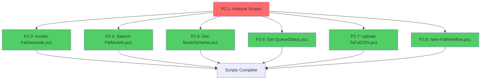
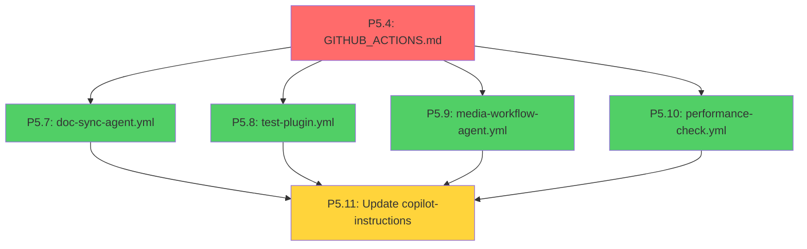
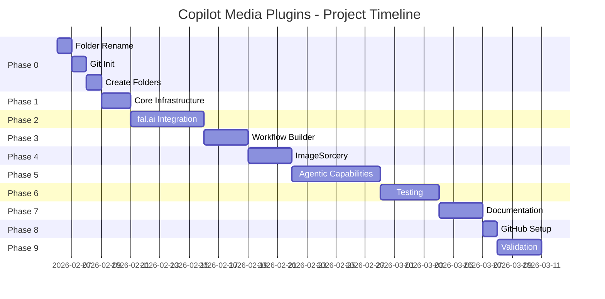

# Task Dependency Graph - Copilot Media Plugins

This document provides visual representations of task dependencies using Mermaid diagrams and ASCII art.

---

## Complete Project Dependency Graph (Mermaid)

```mermaid
graph TD
    %% Phase 0
    P0_1[P0.1: Folder Rename] --> P0_2[P0.2: Git Init]
    P0_2 --> P0_3[P0.3: Create Folders]
    P0_3 --> P0_4[P0.4: .gitignore]
    P0_3 --> P0_5[P0.5: Research Docs]
    
    %% Phase 1
    P0_3 --> P1_1[P1.1: .mcp.json]
    P0_3 --> P1_2[P1.2: README]
    P0_3 --> P1_3[P1.3: LICENSE]
    P0_3 --> P1_4[P1.4: CONTRIBUTING]
    P0_3 --> P1_5[P1.5: copilot-instructions]
    P0_3 --> P1_6[P1.6: ARCHITECTURE]
    
    %% Phase 2
    P1_6 --> P2_1[P2.1: Analyze Scripts]
    P2_1 --> P2_2[P2.2: fal-ai SKILL.md]
    P2_1 --> P2_3[P2.3: Invoke-FalGenerate.ps1]
    P2_1 --> P2_4[P2.4: Search-FalModels.ps1]
    P2_1 --> P2_5[P2.5: Get-ModelSchema.ps1]
    P2_1 --> P2_6[P2.6: Get-QueueStatus.ps1]
    P2_1 --> P2_7[P2.7: Upload-ToFalCDN.ps1]
    P2_1 --> P2_8[P2.8: New-FalWorkflow.ps1]
    
    P2_2 --> P2_9[P2.9: MODELS.md]
    P2_2 --> P2_10[P2.10: WORKFLOWS.md]
    P2_2 --> P2_11[P2.11: PLATFORM.md]
    P2_2 --> P2_12[P2.12: EXAMPLES.md]
    P2_2 --> P2_13[P2.13: API.md]
    
    %% Phase 3
    P2_13 --> P3_1[P3.1: fal-workflow SKILL.md]
    P3_1 --> P3_2[P3.2: NODE_TYPES.md]
    P3_1 --> P3_3[P3.3: PATTERNS.md]
    P3_1 --> P3_4[P3.4: TROUBLESHOOTING.md]
    P3_1 --> P3_5[P3.5: New-Workflow.ps1]
    
    %% Phase 4
    P1_1 --> P4_1[P4.1: Configure MCP]
    P4_1 --> P4_2[P4.2: image-sorcery SKILL.md]
    P4_2 --> P4_3[P4.3: TIER1_OPERATIONS.md]
    P4_2 --> P4_4[P4.4: TIER2_OPERATIONS.md]
    P4_2 --> P4_5[P4.5: TIER3_OPERATIONS.md]
    P4_2 --> P4_6[P4.6: TIER4_OPERATIONS.md]
    P4_2 --> P4_7[P4.7: WORKFLOWS.md]
    P4_3 --> P4_8[P4.8: EXAMPLES.md]
    P4_4 --> P4_8
    P4_5 --> P4_8
    P4_6 --> P4_8
    P4_7 --> P4_8
    P4_1 --> P4_9[P4.9: Test-ImageSorcery.ps1]
    
    %% Phase 5
    P4_9 --> P5_1[P5.1: media-agents SKILL.md]
    P5_1 --> P5_2[P5.2: AGENT_PATTERNS.md]
    P5_1 --> P5_3[P5.3: RELIABILITY.md]
    P5_1 --> P5_4[P5.4: GITHUB_ACTIONS.md]
    P5_1 --> P5_5[P5.5: QUEUE_MANAGEMENT.md]
    P5_1 --> P5_6[P5.6: MONITORING.md]
    
    P5_4 --> P5_7[P5.7: doc-sync-agent.yml]
    P5_4 --> P5_8[P5.8: test-plugin.yml]
    P5_4 --> P5_9[P5.9: media-workflow-agent.yml]
    P5_4 --> P5_10[P5.10: performance-check.yml]
    
    P5_7 --> P5_11[P5.11: Update copilot-instructions]
    P5_8 --> P5_11
    P5_9 --> P5_11
    P5_10 --> P5_11
    P1_5 --> P5_11
    
    P5_11 --> P5_12[P5.12: AGENT_DESIGN.md]
    
    %% Phase 6
    P5_12 --> P6_1[P6.1: tests/README.md]
    P2_3 --> P6_2[P6.2: Unit Tests]
    P2_4 --> P6_2
    P2_5 --> P6_2
    P2_6 --> P6_2
    P2_7 --> P6_2
    P2_8 --> P6_2
    P3_5 --> P6_3[P6.3: Workflow Unit Tests]
    P2_3 --> P6_4[P6.4: Error Handling Tests]
    
    P2_3 --> P6_5[P6.5: fal-ai Integration Tests]
    P2_4 --> P6_5
    P2_5 --> P6_5
    P2_6 --> P6_5
    P2_7 --> P6_5
    P2_8 --> P6_5
    
    P4_9 --> P6_6[P6.6: ImageSorcery Integration]
    P3_5 --> P6_7[P6.7: Workflow Integration]
    
    P6_5 --> P6_8[P6.8: fal-ai E2E Scenarios]
    P6_6 --> P6_9[P6.9: ImageSorcery E2E]
    P6_7 --> P6_10[P6.10: Workflow E2E]
    P6_8 --> P6_11[P6.11: Agent E2E]
    P6_9 --> P6_11
    P6_10 --> P6_11
    
    P6_11 --> P6_16[P6.16: Test CI Workflow]
    P5_8 --> P6_16
    
    %% Phase 7
    P6_16 --> P7_1[P7.1: BEST_PRACTICES.md]
    P6_16 --> P7_2[P7.2: TOKEN_OPTIMIZATION.md]
    P6_16 --> P7_3[P7.3: QUICK_START.md]
    P6_16 --> P7_4[P7.4: TROUBLESHOOTING.md]
    P2_3 --> P7_5[P7.5: Script Documentation]
    P2_4 --> P7_5
    P2_5 --> P7_5
    P2_6 --> P7_5
    P2_7 --> P7_5
    P2_8 --> P7_5
    P3_5 --> P7_5
    P4_9 --> P7_5
    
    P2_2 --> P7_6[P7.6: Review Trigger Phrases]
    P3_1 --> P7_6
    P4_2 --> P7_6
    P5_1 --> P7_6
    
    %% Phase 8
    P7_6 --> P8_1[P8.1: Create Repository]
    P8_1 --> P8_2[P8.2: Configure Repository]
    P0_4 --> P8_3[P8.3: Push Initial Commit]
    P1_3 --> P8_3
    P1_4 --> P8_3
    P7_6 --> P8_3
    P8_2 --> P8_3
    P8_3 --> P8_4[P8.4: Create Initial Release]
    P8_4 --> P8_5[P8.5: Update README Installation]
    P1_2 --> P8_5
    
    %% Phase 9
    P8_3 --> P9_1[P9.1: Run Unit Tests]
    P6_2 --> P9_1
    P6_3 --> P9_1
    P6_4 --> P9_1
    P9_1 --> P9_2[P9.2: Run Integration Tests]
    P6_5 --> P9_2
    P6_6 --> P9_2
    P6_7 --> P9_2
    P9_2 --> P9_3[P9.3: Execute E2E Scenarios]
    P6_8 --> P9_3
    P6_9 --> P9_3
    P6_10 --> P9_3
    P6_11 --> P9_3
    
    P8_5 --> P9_4[P9.4: Test Installation]
    P9_4 --> P9_5[P9.5: Validate PowerShell]
    P9_4 --> P9_6[P9.6: Check Documentation Links]
    P9_6 --> P9_7[P9.7: Spell Check]
    P9_4 --> P9_8[P9.8: Validate .mcp.json]
    P8_3 --> P9_9[P9.9: Test GitHub Actions]
    P5_7 --> P9_9
    P5_8 --> P9_9
    P5_9 --> P9_9
    P5_10 --> P9_9
    P6_16 --> P9_9
    P9_6 --> P9_10[P9.10: Token Budget Audit]
    
    P9_1 --> P9_11[P9.11: Final Code Review]
    P9_2 --> P9_11
    P9_3 --> P9_11
    P9_4 --> P9_11
    P9_5 --> P9_11
    P9_6 --> P9_11
    P9_7 --> P9_11
    P9_8 --> P9_11
    P9_9 --> P9_11
    P9_10 --> P9_11
    
    P9_11 --> P9_12[P9.12: Tag Final Release v1.0.0]
    
    %% Styling
    classDef critical fill:#ff6b6b,stroke:#c92a2a,stroke-width:3px
    classDef parallel fill:#51cf66,stroke:#2f9e44,stroke-width:2px
    classDef blocking fill:#ffd43b,stroke:#fab005,stroke-width:2px
    
    class P0_1,P0_2,P0_3,P1_6,P2_1,P2_2,P2_13,P3_1,P3_5,P4_1,P4_2,P4_9,P5_1,P5_4,P5_12,P6_16,P7_6,P8_1,P8_2,P8_3,P8_4,P8_5,P9_1,P9_2,P9_3,P9_11,P9_12 critical
    class P1_1,P1_2,P1_3,P1_4,P1_5,P2_3,P2_4,P2_5,P2_6,P2_7,P2_8,P4_3,P4_4,P4_5,P4_6,P4_7,P5_2,P5_3,P5_5,P5_6,P5_7,P5_8,P5_9,P5_10,P7_1,P7_2,P7_3,P7_4 parallel
```



---

## Critical Path Visualization


**Critical Path:** 30 tasks  
**Estimated Duration:** 20-35 days

---

## Phase 2 Parallelization (Scripts)



**6 tasks can run in parallel**

---

## Phase 5 Agent Creation



**4 agents can be created in parallel**

---

## Gantt Chart (Simplified)



---

## ASCII Dependency Tree

```
copilot-media-plugins/
│
├─ Phase 0: Setup (2-4 hours)
│  ├─ P0.1 Folder Rename [CRITICAL]
│  │  └─ P0.2 Git Init [CRITICAL]
│  │     └─ P0.3 Create Folders [CRITICAL]
│  │        ├─ P0.4 .gitignore [parallel]
│  │        └─ P0.5 Research Docs [parallel]
│  │
├─ Phase 1: Infrastructure (1-2 days)
│  └─ P0.3 [from above]
│     ├─ P1.1 .mcp.json [parallel]
│     ├─ P1.2 README [parallel]
│     ├─ P1.3 LICENSE [parallel]
│     ├─ P1.4 CONTRIBUTING [parallel]
│     ├─ P1.5 copilot-instructions [parallel]
│     └─ P1.6 ARCHITECTURE [CRITICAL]
│
├─ Phase 2: fal.ai (3-5 days)
│  └─ P1.6 [from above]
│     └─ P2.1 Analyze Scripts [CRITICAL]
│        ├─ P2.2 SKILL.md [CRITICAL]
│        │  ├─ P2.9 MODELS.md [parallel]
│        │  ├─ P2.10 WORKFLOWS.md [parallel]
│        │  ├─ P2.11 PLATFORM.md [parallel]
│        │  ├─ P2.12 EXAMPLES.md [parallel]
│        │  └─ P2.13 API.md [CRITICAL]
│        │
│        ├─ P2.3 Invoke-FalGenerate.ps1 [parallel]
│        ├─ P2.4 Search-FalModels.ps1 [parallel]
│        ├─ P2.5 Get-ModelSchema.ps1 [parallel]
│        ├─ P2.6 Get-QueueStatus.ps1 [parallel]
│        ├─ P2.7 Upload-ToFalCDN.ps1 [parallel]
│        └─ P2.8 New-FalWorkflow.ps1 [parallel]
│
├─ Phase 3: Workflow Builder (2-3 days)
│  └─ P2.13 [from above]
│     └─ P3.1 SKILL.md [CRITICAL]
│        ├─ P3.2 NODE_TYPES.md [parallel]
│        ├─ P3.3 PATTERNS.md [parallel]
│        ├─ P3.4 TROUBLESHOOTING.md [parallel]
│        └─ P3.5 New-Workflow.ps1 [CRITICAL]
│
├─ Phase 4: ImageSorcery (2-3 days)
│  ├─ P1.1 [from Phase 1]
│  │  └─ P4.1 Configure MCP [CRITICAL]
│  │     ├─ P4.2 SKILL.md [CRITICAL]
│  │     │  ├─ P4.3 TIER1_OPERATIONS.md [parallel]
│  │     │  ├─ P4.4 TIER2_OPERATIONS.md [parallel]
│  │     │  ├─ P4.5 TIER3_OPERATIONS.md [parallel]
│  │     │  ├─ P4.6 TIER4_OPERATIONS.md [parallel]
│  │     │  ├─ P4.7 WORKFLOWS.md [parallel]
│  │     │  └─ [all above] ──> P4.8 EXAMPLES.md
│  │     │
│  │     └─ P4.9 Test-ImageSorcery.ps1 [CRITICAL]
│  │
├─ Phase 5: Agentic (4-6 days)
│  └─ P4.9 [from above]
│     └─ P5.1 SKILL.md [CRITICAL]
│        ├─ P5.2 AGENT_PATTERNS.md [parallel]
│        ├─ P5.3 RELIABILITY.md [parallel]
│        ├─ P5.4 GITHUB_ACTIONS.md [CRITICAL]
│        │  ├─ P5.7 doc-sync-agent.yml [parallel]
│        │  ├─ P5.8 test-plugin.yml [parallel]
│        │  ├─ P5.9 media-workflow-agent.yml [parallel]
│        │  └─ P5.10 performance-check.yml [parallel]
│        │     └─ [all above] ──> P5.11 Update instructions
│        │
│        ├─ P5.5 QUEUE_MANAGEMENT.md [parallel]
│        └─ P5.6 MONITORING.md [parallel]
│           └─ P5.12 AGENT_DESIGN.md [CRITICAL]
│
├─ Phase 6: Testing (3-4 days)
│  └─ P5.12 [from above]
│     ├─ P6.1 README [parallel with tests]
│     ├─ [P2.3-P2.8] ──> P6.2 Unit Tests [parallel]
│     ├─ [P3.5] ──> P6.3 Workflow Unit Tests [parallel]
│     ├─ [P2.3-P2.8] ──> P6.4 Error Unit Tests [parallel]
│     ├─ [P2.3-P2.8] ──> P6.5 fal-ai Integration [parallel]
│     ├─ [P4.9] ──> P6.6 ImageSorcery Integration [parallel]
│     ├─ [P3.5] ──> P6.7 Workflow Integration [parallel]
│     ├─ [P6.5] ──> P6.8 fal-ai E2E [parallel]
│     ├─ [P6.6] ──> P6.9 ImageSorcery E2E [parallel]
│     ├─ [P6.7] ──> P6.10 Workflow E2E [parallel]
│     └─ [P6.8-P6.10] ──> P6.11 Agent E2E
│        └─ P6.16 Test CI Workflow [CRITICAL]
│
├─ Phase 7: Documentation (2-3 days)
│  └─ P6.16 [from above]
│     ├─ P7.1 BEST_PRACTICES.md [parallel]
│     ├─ P7.2 TOKEN_OPTIMIZATION.md [parallel]
│     ├─ P7.3 QUICK_START.md [parallel]
│     ├─ P7.4 TROUBLESHOOTING.md [parallel]
│     ├─ [P2.3-P2.8, P3.5, P4.9] ──> P7.5 Script Docs [parallel]
│     └─ [P2.2, P3.1, P4.2, P5.1] ──> P7.6 Review Triggers [CRITICAL]
│
├─ Phase 8: GitHub Setup (1 day)
│  └─ P7.6 [from above]
│     └─ P8.1 Create Repository [CRITICAL]
│        └─ P8.2 Configure Repository [CRITICAL]
│           └─ P8.3 Push Initial Commit [CRITICAL]
│              └─ P8.4 Create Initial Release [CRITICAL]
│                 └─ P8.5 Update README [CRITICAL]
│
└─ Phase 9: Validation (2-3 days)
   └─ P8.5 [from above]
      ├─ P9.1 Run Unit Tests [CRITICAL]
      │  └─ P9.2 Run Integration Tests [CRITICAL]
      │     └─ P9.3 Execute E2E Scenarios [CRITICAL]
      │
      ├─ P9.4 Test Installation [parallel]
      │  ├─ P9.5 Validate PowerShell [parallel]
      │  ├─ P9.6 Check Links [parallel]
      │  │  ├─ P9.7 Spell Check [parallel]
      │  │  └─ P9.10 Token Budget Audit [parallel]
      │  │
      │  ├─ P9.8 Validate .mcp.json [parallel]
      │  └─ P9.9 Test GitHub Actions [parallel]
      │
      └─ [All P9.1-P9.10] ──> P9.11 Final Review [CRITICAL]
         └─ P9.12 Tag v1.0.0 [CRITICAL] 🎉
```

---

## Blocking Relationships Matrix

| Task | Blocks | Blocked By |
|------|--------|------------|
| P0.1 | All tasks | None |
| P0.3 | Phase 1 (6 tasks) | P0.2 |
| P1.6 | P2.1 | P0.3 |
| P2.1 | 8 tasks (P2.2-P2.8, refs) | P1.6 |
| P2.13 | P3.1 | P2.2 |
| P3.5 | P4 start | P3.1 |
| P4.1 | P4.2, P4.9 | P1.1 |
| P4.9 | P5.1 | P4.1 |
| P5.4 | 4 agents | P5.1 |
| P5.12 | P6 start | P5.1-P5.11 |
| P6.16 | P7 start | P5.12 + tests |
| P7.6 | P8.1 | P6.16 |
| P8.1-P8.5 | P9 start | Sequential |
| P9.3 | P9.11 | P9.1, P9.2 |
| P9.11 | P9.12 | All P9.1-P9.10 |

---

## Parallel Work Windows

### Window 1: Phase 1 (After P0.3)
**Duration:** 1-2 days  
**Tasks:** P1.1, P1.2, P1.3, P1.4, P1.5, P1.6  
**Workers Needed:** 6

### Window 2: Phase 2 Scripts (After P2.1)
**Duration:** 2-3 days  
**Tasks:** P2.3, P2.4, P2.5, P2.6, P2.7, P2.8  
**Workers Needed:** 6

### Window 3: Phase 2 References (After P2.2 + scripts)
**Duration:** 1-2 days  
**Tasks:** P2.9, P2.10, P2.11, P2.12, P2.13  
**Workers Needed:** 5

### Window 4: Phase 4 Tier Docs (After P4.2)
**Duration:** 1-2 days  
**Tasks:** P4.3, P4.4, P4.5, P4.6, P4.7  
**Workers Needed:** 5

### Window 5: Phase 5 Agents (After P5.4)
**Duration:** 2-3 days  
**Tasks:** P5.7, P5.8, P5.9, P5.10  
**Workers Needed:** 4

### Window 6: Phase 6 Tests (After P5.12)
**Duration:** 3-4 days  
**Tasks:** P6.1-P6.11 (10+ tasks)  
**Workers Needed:** 10+

### Window 7: Phase 7 Docs (After P6.16)
**Duration:** 1-2 days  
**Tasks:** P7.1, P7.2, P7.3, P7.4, P7.5  
**Workers Needed:** 5

### Window 8: Phase 9 Validations (After P9.3)
**Duration:** 1-2 days  
**Tasks:** P9.4, P9.5, P9.6, P9.7, P9.8, P9.9, P9.10  
**Workers Needed:** 7

---

## Summary Statistics

**Total Tasks:** 100+  
**Critical Path Tasks:** 30  
**Parallelizable Tasks:** ~60  
**Max Parallel Workers:** 10 (Phase 6)  
**Parallel Windows:** 8  
**Estimated Sequential:** 20-35 days  
**Estimated Parallel:** 12-20 days (40-50% reduction)

---

*Last Updated: 2026-02-06*  
*For dependency details, see [dependencies.md](./dependencies.md)*  
*For GitHub issue structure, see [github-issues.md](./github-issues.md)*
